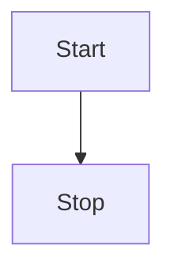

# VuePress

::: demo

```vue
<template>
  <button class="demo-btn" @click="alertUser">Alert</button>
</template>

<script>
export default {
  methods: {
    alertUser() {
      alert("hello!");
    }
  }
};
</script>
```

:::

## vuepress-plugin-vue-demo-example

::: demo example description

```html {2}
<template>
  <div>example code</div>
</template>
```

:::

## Config

When adding markdown-it plugins, you can omit the text `markdown-it`.  
Example:

```js
{
  markdown: {
    plugins: ["fontawesome", "codesandbox", "block-embed"];
  }
}
```

## Markdown Plugins

Notes on good plugins

### Video Embed

[Plugin Repo](https://github.com/rotorz/markdown-it-block-embed)

<!-- @[youtube](movie id) -->

**Code:**

```markdown
@[vimeo](353944853)
```

**Example:**

@[vimeo](353944853)

---

### CodeSandbox

[Plugin Repo](https://github.com/sergiodxa/markdown-it-codesandbox)

**Code:**

```markdown
@[codesandbox](vue-firebase-api-optimized-requests-h4rgf)
```

**Example:**

@[codesandbox](vue-firebase-api-optimized-requests-h4rgf)

---

### FontAwesome

[Plugin Repo](https://github.com/nunof07/markdown-it-fontawesome)

#### Example:

Hello World! :fas-flag:

- [:fab-google: Google](https://www.google.com/)
- [:fab-github: GitHub](https://github.com/)

---

### Mermaid

[Mermaid.js](https://mermaidjs.github.io/)

<mermaid />

```mermaid
graph TD
  subgraph
    event1["USER_SUSPENDED"]
    event1 --> keycloak1("Blocage du compte")
  end
  subgraph
    event2["USER_SUSPENDED"]
    event2 --> workplace1("Blocage du compte")
  end

  style keycloak1 fill:#ffb6c1
  style workplace1 fill:#e6e6fa
  style event1 fill:#c1cdc1,stroke:#333,stroke-width:2px,stroke-dasharray: 10
  style event2 fill:#c1cdc1,stroke:#333,stroke-width:2px,stroke-dasharray: 10
```




## Demo Test
